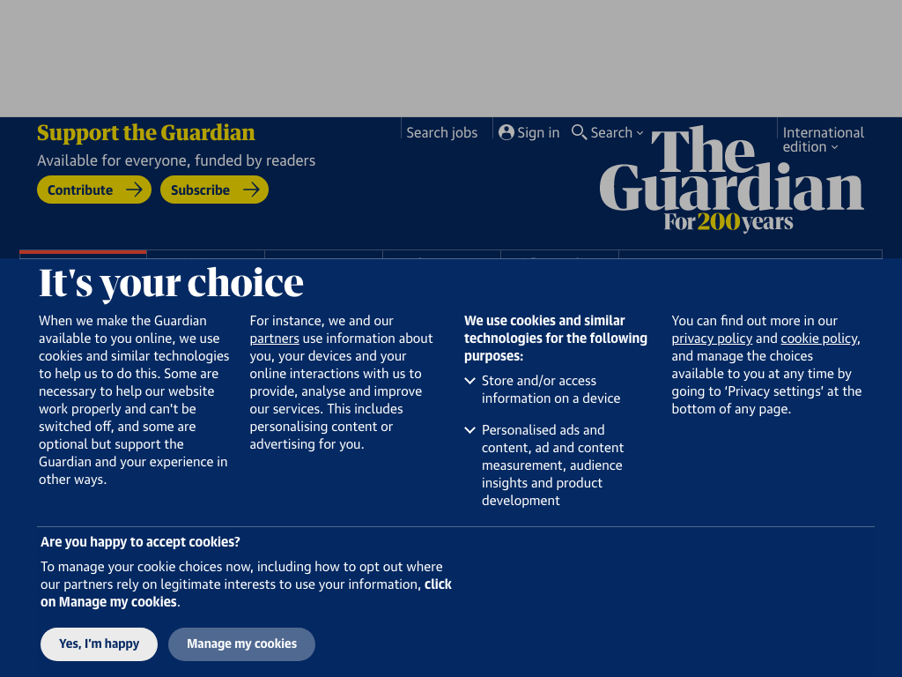
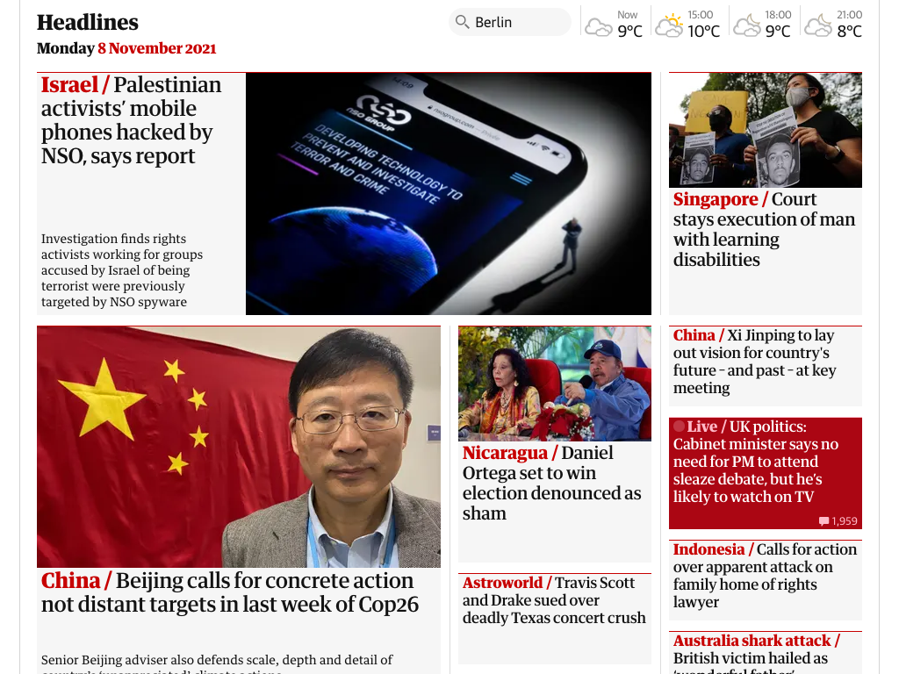

[](https://badge.fury.io/js/zhot)

# zhot

**Web screenshots made super-easy**


&nbsp;

### Introduction

This module provides an easy shell around **[puppeteer](https://github.com/puppeteer/puppeteer/blob/main/README.md)**, a powerful automation tool that allows remote control of a browser. **zhot** can be used to make screenshots from your own node.js javascript code, or by using a simple command line utility. Because it's using a real browser, pages built on the fly by javascript can be screenshotted.

* **zhot** can also capture a single element on the rendered page, and can execute arbitrary javascript in the context of the page before the image is taken.

* Many pages just render cookie warnings and newsletter begging when viewed for the first time. **zhot** allows capturing cookies from an interactive browsing session and then using those for subsequent headless [(?)](https://en.wikipedia.org/wiki/Headless_browser) screenshots.


&nbsp;

### Prerequisites

* Know how to use a command prompt / terminal
* **[Node.js](https://en.wikipedia.org/wiki/Node.js)** (runs javascript outside of a browser)
* **[npm](https://en.wikipedia.org/wiki/Npm_(software))** (the associated software installer)

(Easy node/npm installers for Mac and Windows are **[here](https://nodejs.org/en/download/)**.)


&nbsp;

### Installation

```text
$ npm install --global zhot
```

(The `--global` is to make sure the command line tool is installed.)


&nbsp;

### Simplest Usage

**Command line:**

```text
$ zhot https://github.com
Screenshot saved to 'screenshot.png'.
$ open screenshot.png
```

> 

&nbsp;


**example.js:**

```js
require('zhot')({
    url: "https://github.com",
    outputFile: "screenshot.png",
    statusFunction: console.log
});
```

```text
$ node example.js
Screenshot saved to 'screenshot.jpg'.
```


&nbsp;

### Command Line Reference

```text
$ zhot --help
zhot <url>

Positionals:
  url  The URL to browse to.                                            [string]

Options:
      --help          Show help                                        [boolean]
      --version       Show version number                              [boolean]
  -w, --width         Viewport width                              [default: 800]
  -h, --height        Viewport height                             [default: 600]
  -s, --selector      DOM element to image, a la querySelector()
                                                [string] [default: "whole page"]
  -i, --invisible     Matching elements become invisible                [string]
  -r, --remove        Matching elements are removed                     [string]
  -e, --evaluate      Javascript that will be evaluated in page context when
                      loading has finished                              [string]
  -f, --evaluateFile  File with javascript that will be evaluated in page
                      context when loading has finished                 [string]
  -E, --evalOutput    Output of evaluation to stdout                   [boolean]
  -t, --settleTime    Give browser this many milliseconds to settle before
                      screenshot
  -b, --writeCookies  Start interactive browsing session and save cookies to
                      this file                                         [string]
  -c, --readCookies   Load cookies from file                            [string]
  -q, --quiet         Supress status updates                           [boolean]
  -d, --debug         Show browser console and detailed error info     [boolean]
  -H, --head          disable headless mode                            [boolean]
  -o, --outputFile    Filename for screenshot. Formats: png, jpg or webp,
                      selected by extension.[string] [default: "screenshot.png"]
```


&nbsp;

### API Reference

**example:**

```javascript
const fs = require('fs');
const { exit } = require('process');

const zhot = require('zhot');

const filename = 'somefile.png';
const url = 'https://example.com';

const config = {
    defaultViewport: {
        width: 1024,
        height: 768
    },
    outputFile: filename,
    url: url,
};

zhot(config)
    .then(() => {
        const {size} = fs.statSync(filename);
        console.log(`${size} bytes written to ${filename}.`)
    })
    .catch((e) => {
        console.log(`Whoops: ${e.message}`);
        exit(1);
    })
;
```

**config object**

(`url` and `outputFile` are mandatory elements.)

  - `args` (array) Optional arguments for the browser executable.
  - `consoleFunction` (function) Receives the browser console messages as strings. Set to `console.log` to get these to stdout.
  - `defaultViewport` (Object)
    - `width` (number) Window width, defaults to 800 pixels.
    - `height` (number) Window height, defaults to 600 pixels.
    - `deviceScaleFactor` (number) Defaults to 1.
    - `isMobile` (boolean) Whether the `meta viewport` tag is taken into account. Defaults to `false`.
    - `hasTouch` (boolean) Specifies if viewport supports touch events. Defaults to `false`.
    - `isLandscape` (boolean) Specifies if viewport is in landscape mode. Defaults to `false`.
  - `evaluate` (string *or* function) This is javascript (either a string that is `eval`'d or a function to be called) that will be executed by the browser in the context of the page before the screenshot is taken. The config object is always passed as the first argument to this function. Any return value will in turn be returned when zhot's promise resolves.
  - `evaluateArgs` (array) Optional array with additional arguments to the function provided with `evaluate`.
  - `executablePath` (string) Path to a browser executable to run instead of the bundled Chromium. You're probably better off setting the environment variables if you need to specify this, see [Installation Details](#installation-details) chapter below.
  - `extraHTTPHeaders` (object) Additional HTTP headers for puppeteer to send.
  - `headless` (boolean) Whether to run browser in headless mode.
  - `invisible` (string) Any elements matching this selector are hidden.
  - `settleTime` (number) Give browser this many milliseconds to settle before screenshot.
  - `statusFunction` (function) Receives strings with progress information (i.e. "*Cookies loaded from 'somefile'.*", "*Screenshot saved to 'screenshot.png'.*", etc). Set to `console.log` to get these to stdout.
  - **`outputFile`** (string) Filename for the resulting image. Formats: png, jpg or webp, selected by extension.
  - `readCookies` (string) Cookie file, as written by the command-line tool when started with `-b`.
  - `remove` (string) Removes any elements matching this selector.
  - `selector` (string) Select first element matching this descriptor for screenshot. 
  - **`url`** (string) URL to browse to.

(Apart from holding zhot's own configuration, the `config` object is also passed unmodified as the `options` to `puppeteer.launch`, so if you read its [documentation](https://github.com/puppeteer/puppeteer/blob/v11.0.0/docs/api.md#puppeteerlaunchoptions), you may find some more options you could use, although not everything makes sense in the context of what **zhot** does.)

**return value**

`zhot` returns a promise that resolves to the return value of what you passed as `config.evaluate`, or `true` if you didn't pass anything. If what you evaluate returns an object with a property named `cancelScreenshot`, all subsequent operations are cancelled and the promise resolves with the returned object. 


&nbsp;

### Installation Details

**zhot** depends on **[puppeteer](https://github.com/puppeteer/puppeteer/blob/main/README.md)**, which in turn installs a Chromium binary that is know to work with it. But many recent versions of Chrome and (experimental support) Firefox will apparently work with it. But it will only install Chromium for supported operating systems, and FreeBSD (which I use for my server) was not supported. If you run into problems with puppeteer during installation, you might want to try something like this:

```text
export PUPPETEER_SKIP_CHROMIUM_DOWNLOAD=true
export PUPPETEER_EXECUTABLE_PATH=/usr/local/bin/chrome
npm install --global zhot
```

`PUPPETEER_EXECUTABLE_PATH` must be set when you use **zhot** after that, unless you use **zhot**'s node API and specify the binary with `executablePath` in the options. If you want to use the installed copy of Chrome on a Mac, the binary is likely at<br> `/Applications/Google Chrome.app/Contents/MacOS/Google Chrome`.


&nbsp;

### Using Zhot's Features

Say I want a screenshot of [The Guardian's webpage](https://guardian.co.uk). First I might try:

```text
$ zhot -w 1024 -h 768 https://guardian.co.uk && open screenshot.png
Screenshot saved to 'screenshot.png'.
```

> 

As you can see there's an annoying modal cookie dialog blocking the view. To solve this, I start zhot in the `writeCookies` mode.

```text
$ zhot -w 1024 -h 768 -b guardiancookies https://guardian.co.uk
```

A browser window opens, and then the terminal window says:

```text
Press enter to save cookies and exit browser.
```

Then I use the browser to click any dialogs away. Once all clear, I focus back to the terminal and hit enter.

```text
Cookies saved to 'guardiancookies'.
```

Now to use these cookies to get the screenshot, I do:

```text
$ zhot -w 1024 -h 768 -c guardiancookies https://guardian.co.uk && open screenshot.png
Cookies loaded from 'guardiancookies'.
Screenshot saved to 'screenshot.png'.
```

> 

Better, but still a lot of space is taken up by the ad banner and header at the top. Using Chrome's DevTools, I find out that they are both inside a `<div id="bannerandheader">`, which we can simply remove:

```text
$ zhot -w 1024 -h 768 -c guardiancookies -r '#bannerandheader' https://guardian.co.uk && open screenshot.png
Cookies loaded from 'guardiancookies'.
Removed 1 element(s).
Screenshot saved to 'screenshot.png'.
```

> 

There! That's a nice screenshot!

&nbsp;

(I use `zhot -b` on my Mac to create cookie files and then create screenshots using these cookies on a server that has no display.)


&nbsp;

### Screenshots of tweets

Getting a screenshot of a single tweet can be tricky, esp. if that tweet is a reply to another. Fortunately, I also wrote **[tweetzhot](https://github.com/ropg/tweetzhot)**, which uses zhot underneath but presents its own easy-to-use interface. Check it out...
